# NotionSafe

NotionSafe is a cross-platform desktop backup tool for Notion. The current codebase ships a native Windows GUI built with Qt, a native Linux GUI built with GTK, a CLI mode, a first-run configuration wizard, OS-native scheduling, optional external-drive copying, optional Git-based history, and a bundled static docs site under `site/`.


## Current Project State

- Package name: `notionsafe`
- Current version in `pyproject.toml`: `0.1.0`
- Python requirement: `>=3.10`
- Default entrypoint: `notionsafe`
- Alternate entrypoint: `python -m notebackup`
- Default config path: `~/.noteback/config.yaml`
- Token sources: `NOTION_TOKEN` environment variable or system keyring
- Primary backup flow: export selected Notion pages/databases into timestamped local snapshots
- Optional backup targets: external drive copy and Git remote sync
- Windows scheduler backend: Task Scheduler task named `NotionSafeBackup`
- Linux scheduler backend: `systemd` service/timer installed via `pkexec`
- Included documentation site: `site/index.html` and `site/docs/*.html`

## Screenshot Tour

### Main Application

| Windows dashboard | Linux dashboard |
| --- | --- |
| 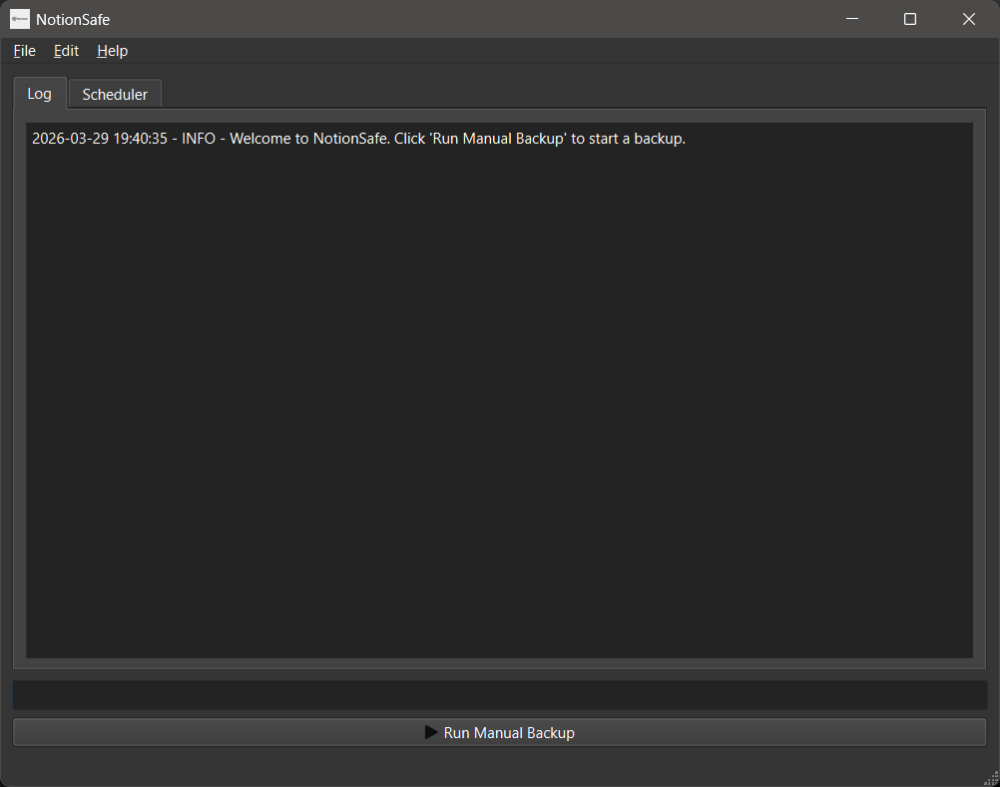 | 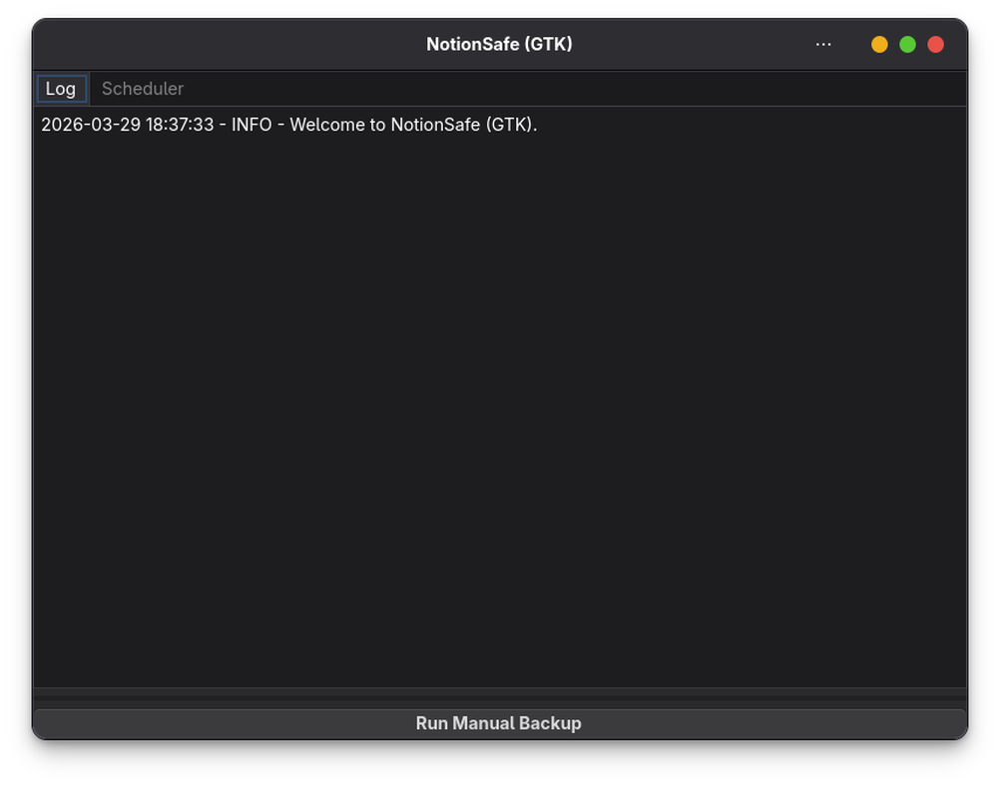 |

### Linux Configuration Wizard

| Welcome | Storage options | Notion token |
| --- | --- | --- |
| 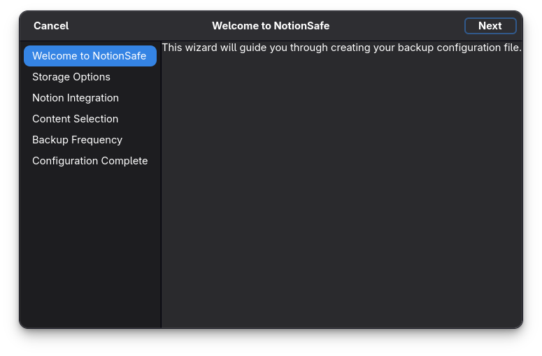 | 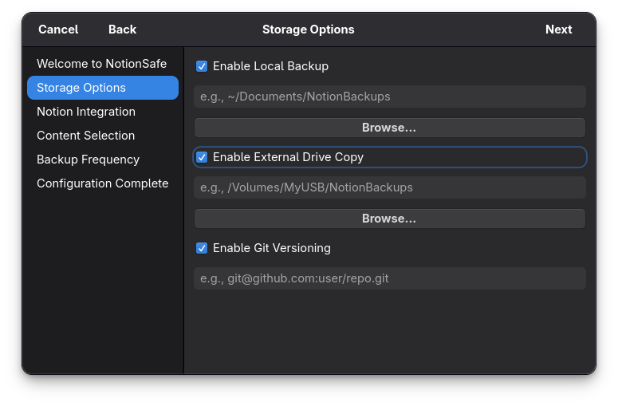 | 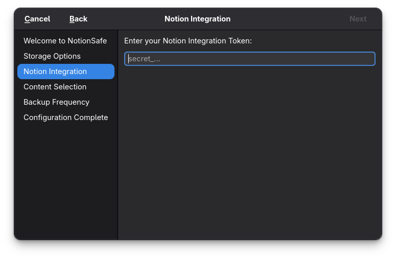 |

| Content selection | Backup frequency | Completion |
| --- | --- | --- |
| 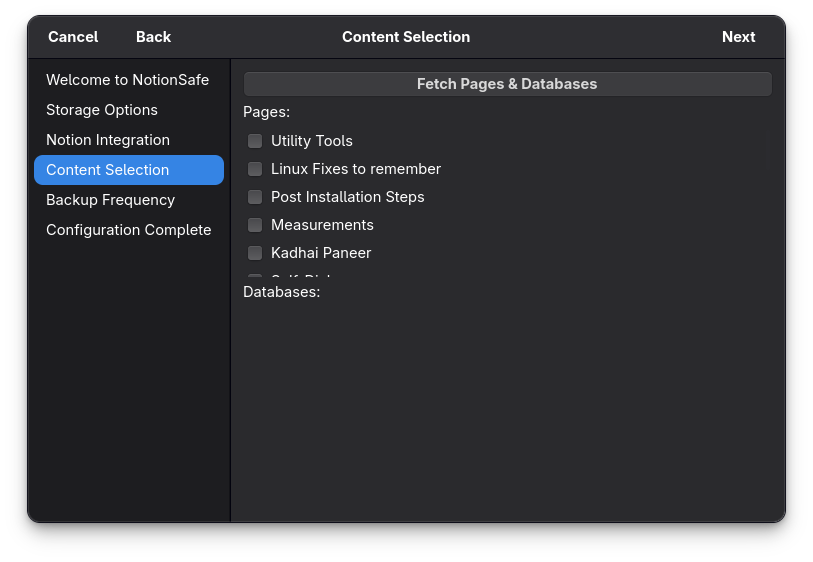 | 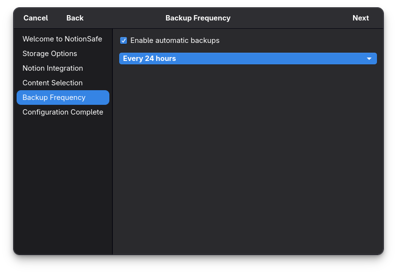 | 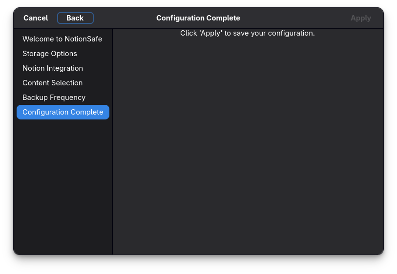 |

### Windows Configuration Wizard

| Welcome | Storage options | Notion token |
| --- | --- | --- |
| 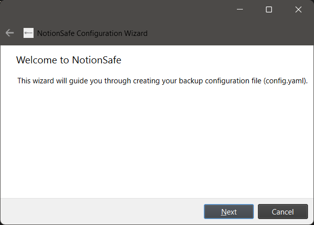 | 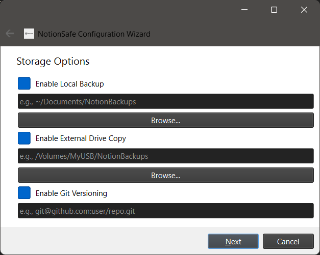 | 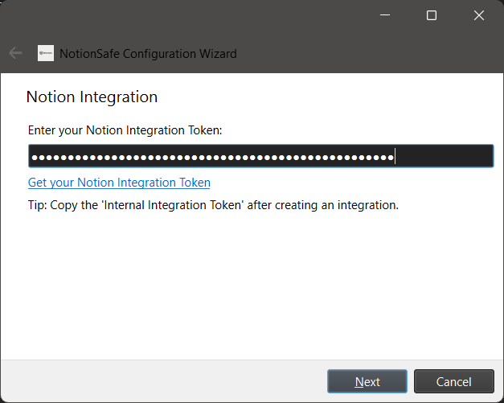 |

| Content selection | Backup frequency | Completion |
| --- | --- | --- |
| 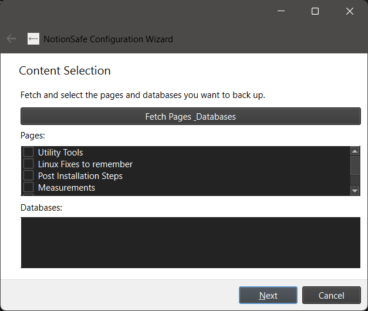 | 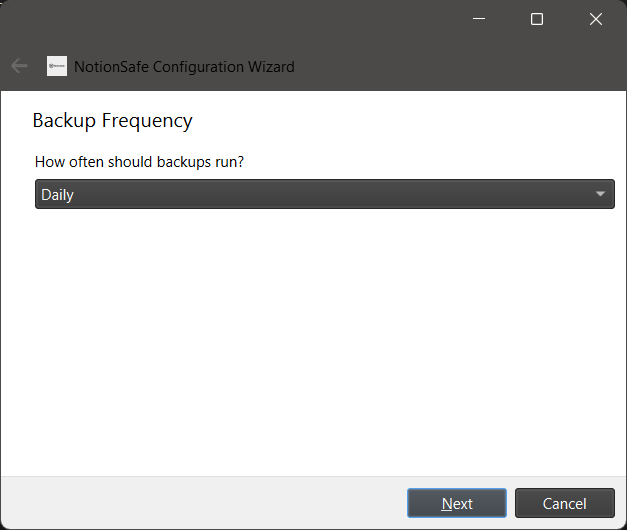 | 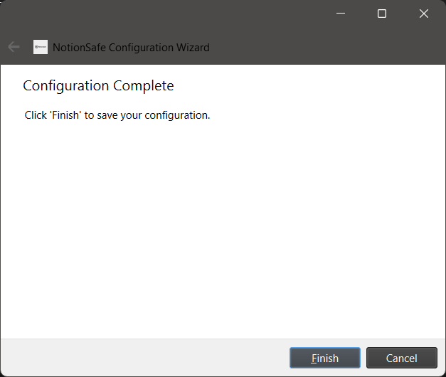 |

### Scheduler States

| Windows enabled | Windows disabled |
| --- | --- |
| 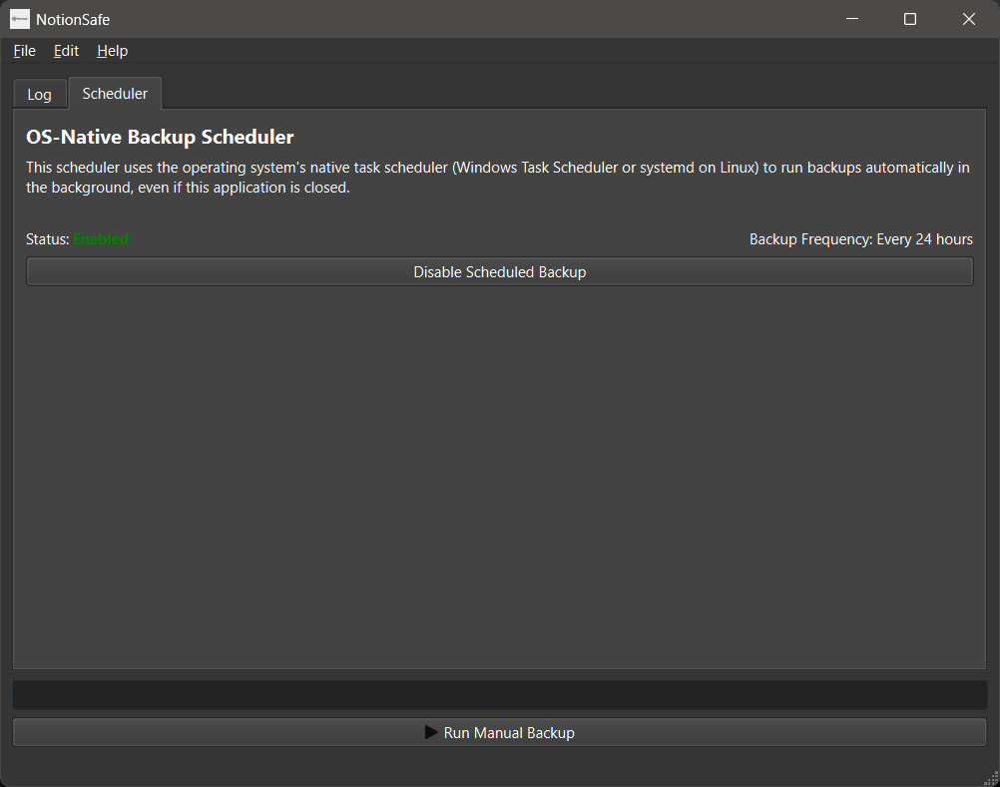 | 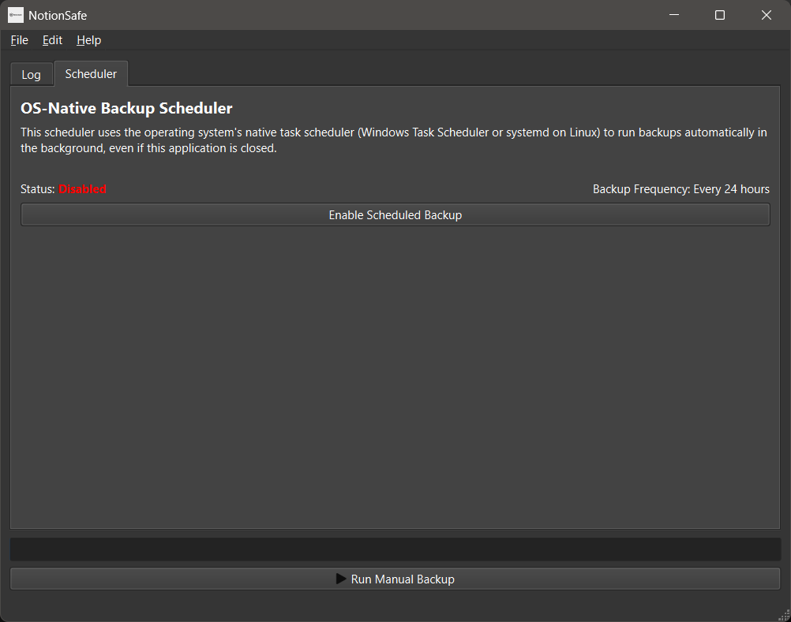 |

| Linux enabled | Linux disabled |
| --- | --- |
| 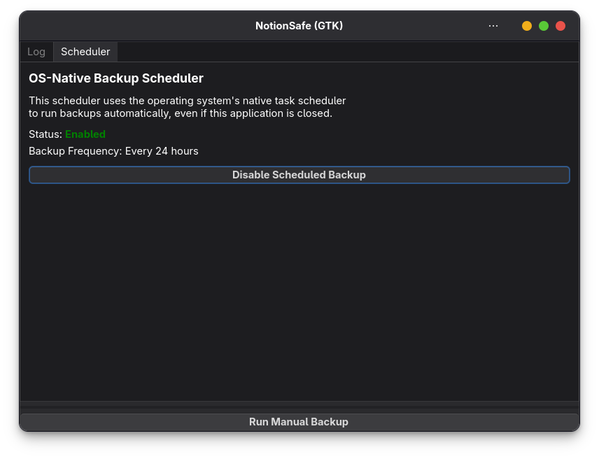 | 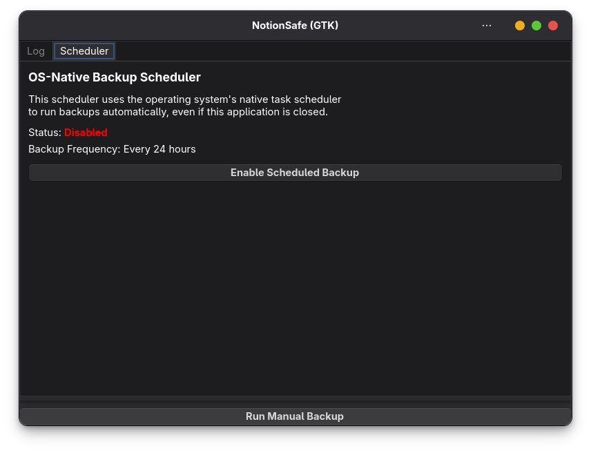 |

## What The App Does Today

NotionSafe currently focuses on backing up selected Notion pages and databases into local timestamped snapshots. The GUI guides you through storing a Notion integration token securely, choosing which content to export, selecting a local backup folder, optionally enabling an external copy target, and optionally connecting a Git remote for versioned history.

The package has two UI implementations in the repo:

- Windows: `notebackup/ui/qt_ui.py` and `notebackup/ui/qt_config_wizard.py`
- Linux: `notebackup/ui/gtk_ui.py` and `notebackup/ui/gtk_config_wizard.py`

Manual backups can be triggered from the GUI or from the CLI. Scheduled backups are delegated to the operating system instead of keeping an in-app scheduler running all the time.

## Installation

### From Source on Linux

Fedora example:

```bash
sudo dnf install gcc python3-devel gtk4-devel gobject-introspection-devel cairo-gobject-devel libsecret-devel polkit

git clone https://github.com/KanishkMishra143/NotionSafe.git
cd NotionSafe

python3 -m venv .venv
source .venv/bin/activate
python -m pip install --upgrade pip
python -m pip install -e ".[gtk]"
```

Notes:

- `PyGObject` is installed through the `gtk` optional dependency.
- `polkit`/`pkexec` is required if you want the Linux scheduler integration to create or remove the `systemd` timer from the GUI.
- On non-Fedora distros, install the equivalent GTK, introspection, and libsecret development packages.

### From Source on Windows

```powershell
git clone https://github.com/KanishkMishra143/NotionSafe.git
cd NotionSafe

py -3.10 -m venv .venv
.venv\Scripts\Activate.ps1
python -m pip install --upgrade pip
python -m pip install -e ".[windows]"
```

### Development Extras

```bash
python -m pip install -e ".[dev]"
```

## Quick Start

1. Create a Notion internal integration at `https://www.notion.so/my-integrations`.
2. Share the pages and databases you want backed up with that integration.
3. Launch NotionSafe:

```bash
notionsafe
```

4. Complete the configuration wizard.
5. Run a manual backup from the main window or enable scheduled backups from the Scheduler tab.

## Running The App

### GUI Mode

```bash
notionsafe
```

Equivalent:

```bash
python -m notebackup
```

### CLI Mode

```bash
notionsafe --cli --config ~/.noteback/config.yaml
```

Equivalent:

```bash
python -m notebackup --cli --config ~/.noteback/config.yaml
```

Help output is available through:

```bash
python -m notebackup --help
```

## Configuration

The default config file lives at:

```text
~/.noteback/config.yaml
```

An example config is included at `examples/backup_config.yaml`.

Minimal shape:

```yaml
notion:
  page_ids:
    - "page-id"
  database_ids:
    - "database-id"

storage:
  local_path: "~/NotionBackups"
  backup_frequency_hours: 24

  external_drive:
    enabled: false
    path: "~/ExternalDrive/NotionBackups"

  git:
    enabled: false
    remote_url: "git@github.com:your-user/notion-backups.git"
    remote_name: "origin"
```

The Notion token is not expected to live in this file. The current auth flow checks:

1. `NOTION_TOKEN`
2. The system keyring entry for service ID `notionsafe`
3. Interactive prompt fallback when running in CLI contexts

## Backup Output Layout

Each run creates a timestamped snapshot directory inside `storage.local_path`, and the latest run is tracked in `latest.txt`.

Example:

```text
/path/to/backups/
├── 2026-04-03_21-30-00/
├── 2026-04-04_09-30-00/
└── latest.txt
```

Inside each snapshot, NotionSafe writes the export generated by `notion2md` for the selected pages and databases. If external-drive sync is enabled, the snapshot folder is copied to the configured external destination. If Git sync is enabled, the backup flow also updates a Git repository.

## Git Backup Behavior

The current Git backup logic keeps two views of your backup history:

- `history` branch: append-only snapshot history, with each snapshot folder committed separately
- `master` branch: force-updated so the branch root always reflects the latest backup contents

This behavior is implemented in `notebackup/gitops.py`.

## Scheduler Behavior

### Windows

- Creates or deletes a Task Scheduler task named `NotionSafeBackup`
- Uses `schtasks`
- Launches the backup runner through `scripts/launch_hidden.py`

### Linux

- Creates or deletes `notionsafe-backup.service` and `notionsafe-backup.timer`
- Uses `pkexec` to write units under `/etc/systemd/system`
- Runs `scripts/backup_runner.py`

If you want scheduled backups on Linux, make sure `systemd` and `pkexec` are available.

## Repo Layout

```text
.
├── notebackup/                  # Main application package
│   ├── __main__.py              # GUI/CLI dispatcher
│   ├── cli.py                   # Backup entrypoint and orchestration
│   ├── auth.py                  # Token resolution and keyring integration
│   ├── gitops.py                # Optional Git backup flow
│   ├── fs_layout.py             # Snapshot directory management
│   ├── storage.py               # External copy support
│   ├── os_scheduler/            # Windows and Linux scheduler backends
│   └── ui/                      # Qt and GTK frontends + wizards
├── scripts/                     # Scheduler/install helper scripts
├── tests/                       # Pytest suite
├── site/                        # Static landing page and docs site
├── assets/                      # App logo/icon
├── packaging/                   # COPR, AUR, desktop packaging files
└── examples/backup_config.yaml  # Example config
```

## Documentation Site

The repo also includes a static site version of the project docs:

- Landing page: `site/index.html`
- Getting started: `site/docs/getting-started.html`
- Installation: `site/docs/installation.html`
- Usage: `site/docs/usage.html`
- Configuration: `site/docs/configuration.html`
- FAQ: `site/docs/faq.html`

## Testing

Run the test suite with:

```bash
pytest -q
```

At the time of this README refresh, `pytest -q tests/test_fs_layout.py` passes locally.
